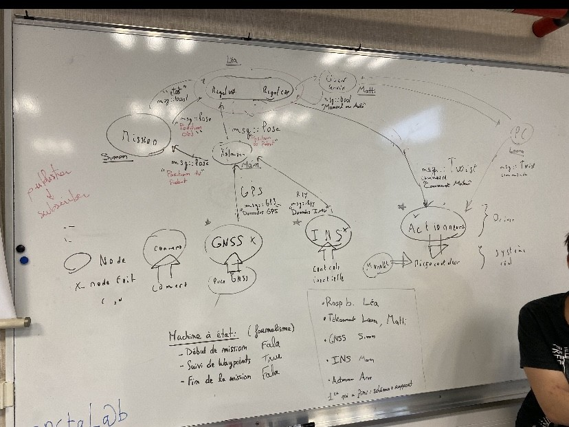
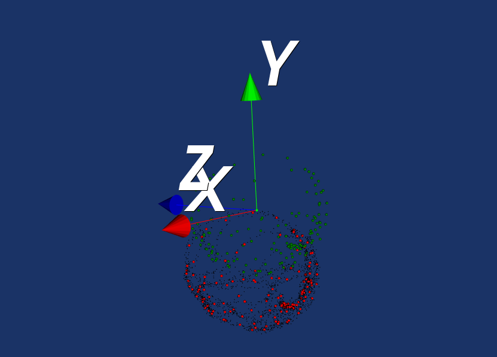

# Déroulement des séances

## Séance 1 - 22/02/2024

Nous avons créé notre groupe pour ce projet. Celui-ci se constitue de Matti Soucaille, Simon Martineau, Léa Rion et Laura Jouvet qui avaient déjà travaillé ensemble sur la voiture et nous avons intégré deux brebis égarées: Main Tihami Ouazzami et Arne Jacobs.

### Structure des nodes
Tout d'abord, Arne a fini de construire l'étage de la Mystery Machine. Nous nous sommes ensuite rassemblés autour du tableau de la mythique salle E006 afin de créer la structure des nodes. Après de longues minutes de réflexion, nous sommes arrivés au (merveilleux) graphe suivant:

### Essais capteurs / Télécommande / Début du code
Nous nous sommes ensuite séparés en trois groupes: Simon, Arne et Main ont commencé à tester les drivers des capteurs, Matti et Laura ont connecté la télécommande à la voiture et Léa a établi la connexion avec la RPi4. 

## Séance 2 - 20/03/2024
Encore une fois, la Mystery Machine Team a dû se séparer.

### Calibration et acquisition
Laura, Lea et Simon avaient pour mission de télécommander la voiture autour de la piste d'athlétisme en faisant une acquisition avec tous les capteurs.
Nous avons commencé par lancer les drivers qui avaient été installés la fois précédente. Le test GPS a bien fonctionné entre les bâtiments puis nous avons perdu le signal sur la piste d'athlétisme.
Nous avons ensuite mis à jour les documents avec le nouveau fichier de Thomas Le Mezo puis nous avons créé un fichier launch pour lancer les drivers.
Nous avons ensuite commencé la calibration du magnétomètre en orientant la voiture dans toutes les directions et nous avons créé un ROS Bag pour récupérer les données de la sphère afin de trouver les matrices A et B que nous devons rentrer dans les fichiers configs.
On avait le Ros Bag mais notre fichier avait un problème dans l'installation de Ros2. L'heure de déjeuner ayant sonné depuis plusieurs minutes, nous avons envoyé l'erreur à Maël et nous sommes partis.

### Structure des nodes
Arne, Main et Matti ont commencé la structure des nodes.

Chacun s'occupait d'un node différent. Arne a commencé à travailler sur le node du filtre Kalman, Main sur le node de mission et Matti sur le node du régulateur.

A la fin de cette séance chacun devait avoir un node qui récupère les bons types de messages et qui publie les bons types de messages (ceux choisit au par avant). On avait plutot bien avancé sur la structure des nodes puisque deux des trois nodes étaient déjà fonctionnels mais sans programme de contrôle ou autre.
**A COMPLETER**

## Séance 3 - 05/04/2024
Pour cette dernière séance, nous avons gardé les mêmes sous-groupes que la dernière fois.

### Calibration et acquisition
Cette séance a été compliquée pour Laura, Léa et Simon. C'est le ventre vide à cause des listeux trop longs pour livrer des crêpes que nous avons essayé de corriger les nombreuses erreurs. Notre code fonctionnait sur l'ordinateur de Maël et nous avons donc essayé tant bien que mal de le faire fonctionner sur le notre.  
Pour cela, nous avons dû installer plusieurs bibliothèques et modifier nos fichiers launch, cmakelist et config. Nous avons alors (ENFIN) réussi à faire le calibrage et à obtenir nos matrices A et B.  

A = [[0.957656, -0.0150408, 0.0571726],
     [-0.0150408, 1.05297, -0.0623213],
     [0.0571726, -0.0623213, 0.99891]]

B = [5.02523, -41.3739, 5.53437]

Sur cette image, nous voyons en rouge la sphère de points que nous avons obtenus et, en vert, la sphère de points de référence que l'on souhaiterait avoir. Les matrices A et B permettent de passer de notre repère au repère souhaité.

### Structure des nodes
Arne, Main et Matti ont continué la structure des nodes.
A la fin de cette séance les 3 nodes s'emboitent bien les uns dans les autres et les messages sont bien transmis entre les nodes.
Nous avons pu vérifier cela sur notre ordinateur mais ayant des problèmes avec la voiture nous n'avons pas pu tester sur la voiture.
**A COMPLETER**
**Fonctionnement du noeud nodeMission**
Le noeud nodeMission est un composant central de notre système robotique, développé sous ROS 2. Il gère les missions en contrôlant la navigation du robot à travers des cibles de position prédéfinies. Voici un aperçu détaillé de ses composants et de son fonctionnement :
Initialisation et Configuration

À son initialisation, nodeMission configure les éléments suivants :

    Timer: Un timer est instauré pour déclencher des actions à intervalles réguliers (tous les 100 millisecondes). Cette fonctionnalité est essentielle pour envoyer des commandes de position répétitives au système de régulation du robot.

    Publishers:
        publisherSendPositionRegulator: Publie des messages geometry_msgs::msg::PoseStamped sur le topic targetPosition. Ces messages dictent la position cible que le robot doit atteindre.
        publisherSendStateBoolRegulator: Publie des messages std_msgs::msg::Bool sur le topic stateBool, utilisés pour signaler divers états du système, comme la réalisation d'une tâche ou des alertes de statut.

    Subscriber:
        subscriberReceivePosition: S'abonne au topic realPosition, qui reçoit la position actuelle du robot encapsulée dans des messages geometry_msgs::msg::PoseStamped. La réception de ces messages déclenche la vérification de la position par rapport aux cibles et l'ajustement des actions en conséquence.

Traitement et Logique de Callback
Gestion des positions cibles

La fonction callbackSubscriptionReceivePosition est appelée à chaque réception d'un message indiquant la position actuelle du robot. Elle procède comme suit :

    Vérification de proximité: Le noeud compare la position actuelle avec la cible en cours. Si le robot est suffisamment proche de la cible (défini par epsilon pour les axes x et y), le processus de mise à jour de la cible est initié.

    Mise à jour de la cible: Si toutes les cibles n'ont pas encore été atteintes, la cible suivante est chargée à partir de target_list, et les valeurs target_x et target_y sont mises à jour pour refléter cette nouvelle cible.

Publication de l'état et de la position

Le callback timerSendCmdcallback est régulièrement invoqué par le timer. Il met à jour et publie la position cible actuelle ainsi que l'état du robot. Cette fonction est cruciale pour maintenir le régulateur informé des objectifs à atteindre et de l'état opérationnel du robot.

## Séance supplémentaire - 11/04/2024
<<<<<<< HEAD
Nous avons décidé de nous retrouver une dernière fois pour finaliser le projet.

### Calibration et acquisition

### Structure des nodes
Nous avons fini de compléter le launch pour lancer au même temps nos trois nodes et les trois nodes des drivers.
Sur l'ordinateur nous arrivons à build sans problème et à lancer le launch qui toutefois pose quelques soucis mais sur la voiture nous n'arrivons pas à build. Nous ne comprennons pas à quoi c'est lié mais le build tourne à l'inifni et ne se termine jamais.
Le groupe de Titouan, Nicolas etc. a essayé leur code fonctionnel sur notre voiture mais ce dernier n'a pas fonctionné. Nous avons donc décidé de ne pas continuer à chercher la source du problème et de rendre le projet tel quel en pensant que le problème vient surement de la voiture.
=======

Le 11 avril, l'équipe s'est réunie une dernière fois. 
Tout d'abord, nous nous sommes expliqué ce que chacun avait fait pour que tout le monde soit à jour sur l'ensemble du projet. Nous nous sommes ensuite réparti les tâches que chacun devrait rédiger dans le rapport en nous fixant des dates limites.
Enfin, nous avons essayé de terminer le projet.
Nous avons essayé de compiler les codes sur la voiture mais après une heure d'attente nous avons abandonné.

# Node architecture
L'architecture utilisée est un seul package pour tous les nodes.

## Camera node
https://index.ros.org/r/usb_cam/

## Motors node
See [voiture2a_motors_driver](./src/voiture2a_motors_driver/README.md) package

## GNSS node
See [gpsd client](./src/gpsd_client/README.md) package

## IMU node
**TODO**

# Liens utiles pour le groupe

## Overleaf, fichier Latex pour le rendu de projet 
https://fr.overleaf.com/9866661758nfpjsjcrcqnp#e54566

## Teams
https://teams.microsoft.com/_?culture=fr-fr&country=fr#/school/FileBrowserTabApp/G%C3%A9n%C3%A9ral?threadId=19:4if7g6Iue2ZQTwf5h9PbC7U7gJQ7TYtp8hfr5uuxIJc1@thread.tacv2&ctx=channel

>>>>>>> 1436b724b41e6d87b0f6f96bef07eb6f48bf7b3c

